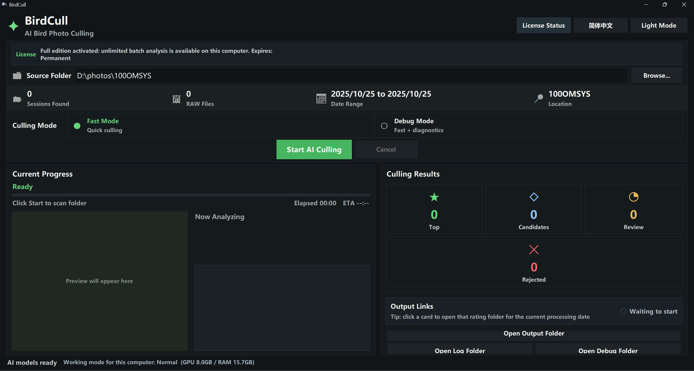

  <a href="README.md">简体中文</a> |
  <a href="README.en.md">English</a>

  

<h1 align="center">BirdCull</h1>

  Desktop culling for bird photographers

  

BirdCull helps you finish the most time-consuming first pass of bird photo selection. It surfaces the stronger shots from each burst so you can move faster into review, editing, and delivery.

## Download

- [Download the latest release](../../releases/latest)
- [Browse all releases](../../releases)

## Download And Install

Open the [latest release page](../../releases/latest), then download the files for your system:

| System | What To Download | How To Install |
| --- | --- | --- |
| `Windows 10 / Windows 11` | Download `BirdCull_Setup_win10_win11.exe` and every `BirdCull_Setup_win10_win11-*.bin` file from the same release | Put the `.exe` and all `.bin` files in the same folder, then run the `.exe` installer |
| Apple silicon Mac | Download `BirdCull_macOS_v1.0.4.dmg` | Open the `.dmg`, then drag `BirdCull.app` to `Applications` |

The Windows download is an installer set: the `.exe` starts the installer, and the `.bin` files contain the payload. They must stay together in the same folder.  
If the release only shows Windows files, use the Windows build. If it shows a macOS DMG, make sure your Mac is an Apple silicon model.

## Device, System, And Version Choice

Choose the installer that matches your system and GPU. Do not mix the newer and older CUDA runtime builds:

| Version | Supported Systems | Recommended Devices / GPUs | Notes |
| --- | --- | --- | --- |
| `v1.0.4` | `Windows 10 / Windows 11`; Apple silicon macOS | Newer Windows PCs, `NVIDIA RTX 20/30/40/50`, `GTX 16`, AMD/CPU fallback; Apple silicon Macs | Latest release, recommended first |
| `v1.0.3` | `Windows 10 / Windows 11` | `NVIDIA RTX 20/30/40/50`, `GTX 16`, AMD DirectML, ONNX CPU | Broad Windows hardware support |
| `v1.0.2` | `Windows 10 / Windows 11` | `NVIDIA RTX 20/30/40/50`, `GTX 16` | CUDA compatibility build with `RTX 50` support |
| `v1.0.1` | `Windows 10 / Windows 11` | Some older `GTX` GPUs, including `GTX 900` and `GTX 10` series | Legacy GPU compatibility build |

`v1.0.4` is the latest release line and includes both Windows and Apple silicon macOS builds.  
`v1.0.2` and newer upgrade the PyTorch / CUDA runtime to support `RTX 50` series GPUs such as `RTX 5090`.  
If you use a `GTX 1050 / 1060 / 1070 / 1080` class `GTX 10` GPU and want GPU acceleration, download `v1.0.1` first.  
If your GPU is outside the supported range, BirdCull may still run through CPU or ONNX fallback, but processing will be slower.

## Version Updates

The latest release is `v1.0.4`:

- Added the Apple silicon macOS build
- Added the current Windows `v1.0.4` installer set
- Shows `v1.0.4` next to the BirdCull title in the app
- Fixed a UI state issue where background model warm-up could still appear after processing had already started
- Filters visible and legacy output folders so reruns do not process previous output results again
- Refreshed Windows and macOS packaged dependencies to reduce release-environment drift

See [v1.0.4 release notes](RELEASE_NOTES_v1.0.4.md) for the full changelog.

## What BirdCull does

- Analyzes bird head, eye, sharpness, pose, and within-burst differences
- Organizes results into `Top`, `Candidate`, `Review`, and `Rejected`
- Uses hard links for output instead of copying your original photos
- Supports both Chinese and English UI
- Lets you activate the full version from inside the app

## Editions

BirdCull now uses a single installer. There are no separate Free and Full installers:

- You can start with the free edition right after installation
- The free edition is meant to let you experience the core workflow
- Activating the full edition unlocks the app without reinstalling

Current free-edition rule:

- Up to the first `200` photos per capture date

If you need the full edition, open the activation window inside the app, copy the device code, and contact the developer for a license.

## Before you install

- You are using `Windows 10` or `Windows 11`
- Your photos are stored on a local drive or an external drive
- The drive supports hard links, ideally `NTFS`
- Recommended hardware: `NVIDIA RTX` series GPU and `16 GB` RAM or more
- Use `v1.0.4` for the latest Windows build and the Apple silicon macOS build
- Use `v1.0.2` or newer for `RTX 50` series GPUs
- Use the `v1.0.1` compatibility build for `GTX 10` series and some older `GTX` GPUs

If your photo folder is on a filesystem that does not support hard links, BirdCull will ask you to move or copy it to a local `NTFS` drive first.

## Quick start

1. Install and open BirdCull
2. Choose your photo folder
3. Set the date range you want to process
4. Click `Start`
5. Open the output results and review `Top`, `Candidate`, `Review`, and `Rejected`

## Output behavior

BirdCull does not duplicate your original photos into rating folders. By default, it creates grouped hard-link outputs:

- `Top`: keep first
- `Candidate`: strong backup picks worth a second look
- `Review`: check again
- `Rejected`: remove first

That means:

- Your original photos stay where they are
- Output is faster
- You avoid filling the drive with duplicate copies

## Activation and privacy

BirdCull includes a built-in activation flow. During activation, it creates a device code on your computer to confirm that the license belongs to this machine.

BirdCull is designed so that it:

- does not upload your photos
- does not upload photo paths
- does not upload EXIF metadata
- does not store raw hardware identifiers
- only uses non-reversible device verification data for licensing

## FAQ

### Why did the free edition not process everything?

The free edition is currently meant to demonstrate the core culling workflow:

- Up to the first `200` photos per capture date

If you want to process full batches, activate the full edition.

### Why does BirdCull say the selected folder cannot be used for output?

BirdCull relies on hard links for output. If the photo folder is on a drive or filesystem that does not support hard links, move or copy the photos to a local `NTFS` drive and load the folder again.

### Can I use it immediately after installation?

Yes. The app starts in the free edition, so you can try the main workflow right away and activate the full edition only when you need it.

### Does it work with Lightroom?

BirdCull is built for the first-pass culling stage. After that, you can continue in your normal post-processing workflow.

## Update advice

If you already have an older version installed, it is best to install the latest version over it.  
If you run into issues, updating to the newest release is also the first thing worth trying.

## Closed-source distribution and third-party components

BirdCull itself is distributed here as proprietary closed-source software.

The current release also bundles or depends on several third-party open-source components. Based on a review of the current core packaged dependencies, we did not identify a core bundled dependency that would, by itself, require BirdCull application source code to be published solely because BirdCull is distributed in binary form.

BirdCull's proprietary license notice is available here: [License Notice](LICENSE.en.md).

Third-party components still remain under their own licenses and notice requirements. See [Third-Party Notices](THIRD_PARTY_NOTICES.en.md).

## Contact

For full-version licensing, feedback, or collaboration:

- Email: `glamecke@gmail.com`
- Xiaohongshu account name: `热爱观鸟的Salamence`

## Notes

This repository is for BirdCull installers and release notes. It is meant for end users rather than developers.
