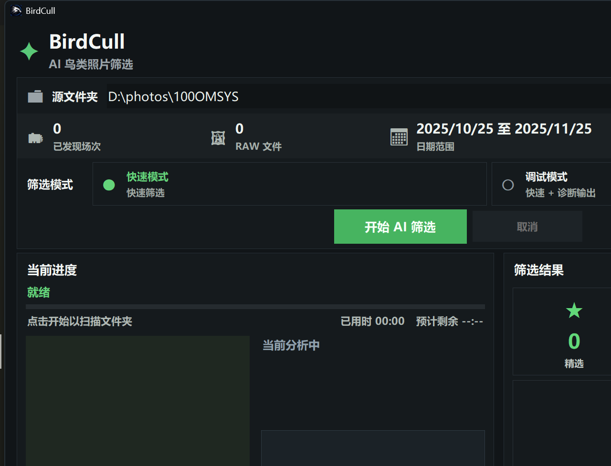

  <a href="README.md">简体中文</a> |
  <a href="README.en.md">English</a>

  

<h1 align="center">BirdCull</h1>

  Desktop culling for bird photographers

  

BirdCull helps you finish the most time-consuming first pass of bird photo selection. It surfaces the stronger shots from each burst so you can move faster into review, editing, and delivery.

## Download

- [Download the latest release](../../releases/latest)
- [Browse all releases](../../releases)

Current builds are for `Windows 10 / Windows 11`.

## What BirdCull does

- Analyzes bird head, eye, sharpness, pose, and within-burst differences
- Organizes results into `Top`, `Review`, and `Rejected`
- Uses hard links for output instead of copying your original photos
- Supports both Chinese and English UI
- Lets you activate the full version from inside the app

## Editions

BirdCull now uses a single installer:

- You can start with the free edition right after installation
- The free edition is meant to let you experience the core workflow
- Activating the full edition unlocks the app without reinstalling

Current free-edition rule:

- Up to the first `200` photos per capture date

If you need the full edition, open the activation window inside the app, copy the device code, and contact the developer for a license.

## Before you install

- You are using `Windows 10` or `Windows 11`
- Your photos are stored on a local drive or an external drive
- The drive supports hard links, ideally `NTFS`
- Recommended hardware: `NVIDIA RTX` series GPU and `16 GB` RAM or more

If your photo folder is on a filesystem that does not support hard links, BirdCull will ask you to move or copy it to a local `NTFS` drive first.

## Quick start

1. Install and open BirdCull
2. Choose your photo folder
3. Set the date range you want to process
4. Click `Start`
5. Open the output results and review `Top`, `Review`, and `Rejected`

## Output behavior

BirdCull does not duplicate your original photos into rating folders. By default, it creates grouped hard-link outputs:

- `Top`: keep first
- `Review`: check again
- `Rejected`: remove first

That means:

- Your original photos stay where they are
- Output is faster
- You avoid filling the drive with duplicate copies

## Activation and privacy

BirdCull includes a built-in activation flow. During activation, it creates a device code on your computer to confirm that the license belongs to this machine.

BirdCull is designed so that it:

- does not upload your photos
- does not upload photo paths
- does not upload EXIF metadata
- does not store raw hardware identifiers
- only uses non-reversible device verification data for licensing

## FAQ

### Why did the free edition not process everything?

The free edition is currently meant to demonstrate the core culling workflow:

- Up to the first `200` photos per capture date

If you want to process full batches, activate the full edition.

### Why does BirdCull say the selected folder cannot be used for output?

BirdCull relies on hard links for output. If the photo folder is on a drive or filesystem that does not support hard links, move or copy the photos to a local `NTFS` drive and load the folder again.

### Can I use it immediately after installation?

Yes. The app starts in the free edition, so you can try the main workflow right away and activate the full edition only when you need it.

### Does it work with Lightroom?

BirdCull is built for the first-pass culling stage. After that, you can continue in your normal post-processing workflow, and the app also includes a shortcut to open Lightroom.

## Update advice

If you already have an older version installed, it is best to install the latest version over it.  
If you run into issues, updating to the newest release is also the first thing worth trying.

## Contact

For full-version licensing, feedback, or collaboration:

- Email: `glamecke@gmail.com`
- Xiaohongshu: `热爱观鸟的Salamence`

## Notes

This repository is for BirdCull installers and release notes. It is meant for end users rather than developers.
