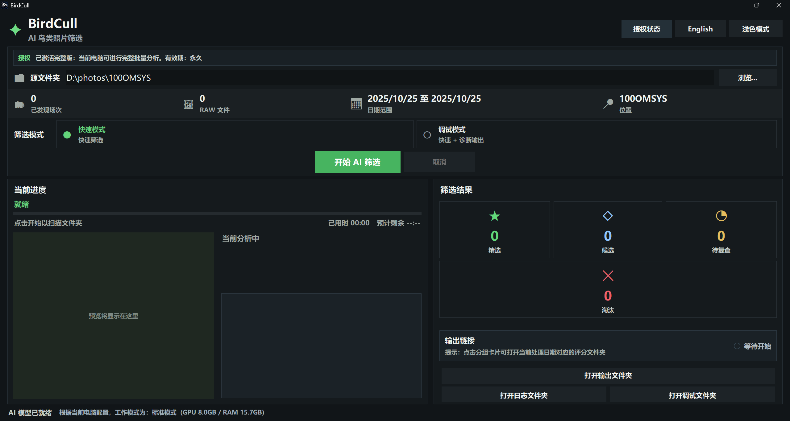

  <a href="README.md">简体中文</a> |
  <a href="README.en.md">English</a>

  

<h1 align="center">BirdCull</h1>

  面向鸟类摄影筛选的桌面工具

  

BirdCull 会先帮你完成最费眼睛的第一轮筛选，把同一组连拍里更值得保留的照片优先整理出来，让你更快进入精修和交付。

## 下载

- [下载最新版](../../releases/latest)
- [查看历史版本](../../releases)

## 下载安装方式

请先打开 [最新版发布页](../../releases/latest)，再按自己的系统下载对应文件：

| 系统 | 下载什么 | 怎么安装 |
| --- | --- | --- |
| `Windows 10 / Windows 11` | 下载 `BirdCull_Setup_win10_win11.exe` | 双击这个 `.exe` 安装 |
| Apple silicon Mac | 下载 `BirdCull_macOS_v1.0.4.dmg` | 打开 `.dmg`，把 `BirdCull.app` 拖到 `Applications` |

从 `v1.0.5` 开始，Windows 版本改为一个完整安装包，不再需要把 `.exe` 和 `.bin` 分卷文件放在一起。  
如果发布页只显示 Windows 文件，请使用 Windows 版本；如果发布页显示 macOS DMG，请确认你的 Mac 是 Apple silicon 机型。

## 设备、系统与版本选择

请根据自己的系统和显卡选择安装包，避免把新旧 CUDA 运行库混用：

| 版本 | 支持系统 | 推荐设备 / 显卡 | 说明 |
| --- | --- | --- | --- |
| `v1.0.5` | `Windows 10 / Windows 11` | 较新的 Windows 电脑、`NVIDIA RTX 20/30/40/50`、`GTX 16`、AMD/CPU 回退 | 当前最新 Windows 版本，优先下载 |
| `v1.0.4` | `Windows 10 / Windows 11`；Apple silicon macOS | 较新的 Windows 电脑、`NVIDIA RTX 20/30/40/50`、`GTX 16`、AMD/CPU 回退；Apple silicon Mac | Windows 分卷安装包和 Apple silicon macOS 构建 |
| `v1.0.3` | `Windows 10 / Windows 11` | `NVIDIA RTX 20/30/40/50`、`GTX 16`、AMD DirectML、ONNX CPU | Windows 硬件支持范围较广 |
| `v1.0.2` | `Windows 10 / Windows 11` | `NVIDIA RTX 20/30/40/50`、`GTX 16` | CUDA 兼容版本，支持 `RTX 50` 系列 |
| `v1.0.1` | `Windows 10 / Windows 11` | 部分较旧 `GTX` 显卡，例如 `GTX 900`、`GTX 10` 系列 | 旧显卡兼容版 |

`v1.0.5` 是当前最新 Windows 发布线。  
`v1.0.4` 仍保留 Apple silicon macOS 构建。  
如果你使用 `GTX 1050 / 1060 / 1070 / 1080` 等 `GTX 10` 系列显卡，并且希望继续使用 GPU 加速，请优先使用 `v1.0.1`。  
如果显卡不在支持范围内，BirdCull 仍可能通过 CPU 或 ONNX 回退模式运行，但速度会更慢。

## 版本更新

当前最新版是 `v1.0.5`：

- Windows 安装包改为单个完整 `.exe`，不再拆成 `.exe` + `.bin` 分卷
- 新增两种输出模式：文件夹分组输出，以及 Lightroom / Bridge / Photo Mechanic 可读取的星级 XMP 输出
- 星级输出会在日期文件夹中写入照片硬链接和同名 `.xmp` 文件，原始 RAW 文件仍保留在原位置
- 星级描述会写入拍摄时间、星级、筛选原因、总分、连拍信息、眼部/头部检测信息
- 软件标题旁会显示 `v1.0.5`
- 修复打包时旧版 `xmp_core.pyd` 覆盖新版 XMP 逻辑的问题
- 保留更频繁的处理阶段预览刷新，方便实时观察检测结果

完整更新记录请查看 [v1.0.5 更新说明](RELEASE_NOTES_v1.0.5.md)。

## 它能做什么

- 自动分析鸟头、眼部、清晰度、姿态和同组差异
- 按结果整理出 `Top`、`Candidate`、`Review`、`Rejected` 四类结果
- 可选择传统文件夹分组输出，或为后期软件写入星级 XMP 元数据
- 输出使用硬链接，不重复复制原始照片，节省磁盘空间
- 支持中英文界面切换
- 支持软件内激活完整版

## 版本说明

BirdCull 现在采用单一安装包，不再区分免费版安装包和完整版安装包：

- 安装后即可直接使用免费版
- 免费版可用于体验核心筛选流程
- 激活后解锁完整版，无需重新安装

当前免费版规则：

- 每个拍摄日期最多分析前 `200` 张照片

如果你需要完整版，请在软件内打开激活窗口，复制设备码并联系开发者获取授权。

## 安装前请先确认

- 系统为 `Windows 10` 或 `Windows 11`
- 照片放在本地磁盘或移动硬盘上
- 磁盘文件系统支持硬链接，推荐使用 `NTFS`
- 建议配置 `NVIDIA RTX` 系列显卡，内存 `16 GB` 及以上
- 请使用 `v1.0.5` 获取最新 Windows 构建
- `RTX 50` 系列请使用 `v1.0.2` 或更新版本
- `GTX 10` 系列及部分更旧 `GTX` 显卡请使用 `v1.0.1` 兼容版

如果你的照片放在不支持硬链接的文件系统里，BirdCull 会提示你先复制到本地 `NTFS` 盘后再处理。

## 使用流程

1. 安装并打开 BirdCull
2. 选择照片文件夹
3. 选择输出模式
4. 设定需要处理的日期范围
5. 点击 `Start`
6. 处理完成后，根据选择的输出模式查看结果

## 输出结果说明

BirdCull 支持两种互斥的输出模式：

### 文件夹分组输出

默认模式。BirdCull 不会把原始照片再复制一份到评分目录，而是创建按结果分组的硬链接：

- `Top`：优先保留
- `Candidate`：整体不错，建议作为备选继续看一轮
- `Review`：建议再看一轮
- `Rejected`：优先淘汰

这种模式适合直接在文件管理器里查看、移动或交付结果。

### 星级 XMP 输出

星级模式会把结果写成后期软件更容易读取的元数据：

- 为每张入选照片创建硬链接
- 在同一日期文件夹中写入同名 `.xmp` 文件
- 根据 BirdCull 评分写入 `5 星`、`4 星`、`3 星`、`2 星`、`1 星`
- 在 XMP 描述中写入筛选原因、总分、连拍组信息、是否检测到眼部/头部

这种模式适合继续导入 Lightroom、Bridge、Photo Mechanic 等软件。标准 `.xmp` 文件是可见文件，会和对应 RAW 文件放在一起，不会被隐藏到内部缓存目录。

## 激活说明

软件内置激活入口。激活时，BirdCull 会在本机生成一个设备码，用来确认授权属于当前电脑。

BirdCull 的激活设计要点：

- 不上传照片
- 不上传照片路径
- 不上传 EXIF 元数据
- 不保存原始硬件信息
- 只使用不可逆的设备校验信息完成授权验证

## 常见问题

### 为什么免费版没有处理完全全部照片？

免费版当前用于体验核心筛选能力，规则是：

- 每个拍摄日期最多分析前 `200` 张照片

如果你要处理完整批次，请激活完整版。

### 为什么软件提示当前文件夹不能用于输出？

BirdCull 的输出依赖硬链接。如果当前照片所在磁盘或文件系统不支持硬链接，请先把照片复制到本地 `NTFS` 磁盘后再重新加载。

### 安装后可以直接用吗？

可以。安装后默认就是免费版，可直接体验主要流程；需要处理完整批次时再激活完整版即可。

### 支持 Lightroom 吗？

支持。你可以使用星级 XMP 输出模式，让 BirdCull 写入 `.xmp` 星级和描述，再把照片继续导入 Lightroom、Bridge 或 Photo Mechanic。

## 更新建议

如果你已经安装过旧版本，建议下载最新版本覆盖安装。  
如果你在使用过程中遇到问题，也建议先升级到最新版本后再重试。

## 闭源发布与第三方组件说明

BirdCull 自身在这里以闭源软件形式发布。

基于对当前核心打包依赖的核查，我们没有发现某个核心随包依赖会仅仅因为 BirdCull 以二进制安装包形式发布，就当然要求公开 BirdCull 自身源码。

BirdCull 的闭源许可声明见：[许可声明](LICENSE.md)。

第三方依赖说明见：[第三方组件说明](THIRD_PARTY_NOTICES.md)。

## 联系方式

- 邮箱：`glamecke@gmail.com`
- 小红书：`热爱观鸟的Salamence`

## 说明

本仓库用于发布 BirdCull 安装包和版本说明，面向最终用户，不提供开发文档和源码说明。
